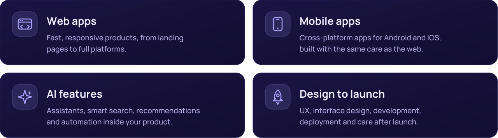

  

  
  

## About

**gitget** is a small team from Bosnia and Herzegovina that designs and builds web and mobile applications with AI at their core. We take ideas from the first sketch to a product that is live, fast and easy to use.

## What we do

## How we work

## Tech we use

  
  
  
  
  
  
  
  

## Contact

Have an idea or a project? Write to us at **[gitget.official@gmail.com](mailto:gitget.official@gmail.com)** and we will get back to you.
